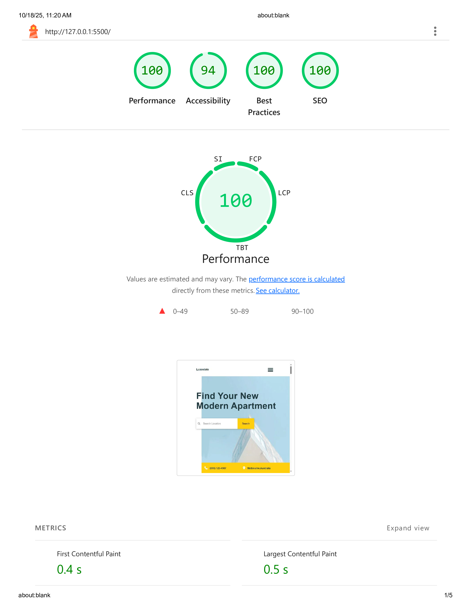
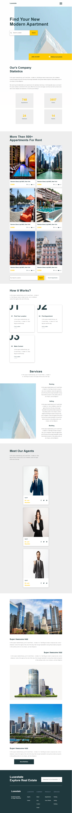

# 🏠 Luxestate Real Estate Landing Page

A modern and fully responsive real estate landing page built using **HTML, CSS, and Vanilla JavaScript**.  
This project demonstrates professional front-end layout design, user interaction effects, and accessibility optimization.

---

## 🚀 Live Demo

👉 [View Live Demo](https://github.com/ahmednabil22224/Luxestate-Template/)

---

## 🌟 Lighthouse Report



| Metric            | Score |
| ----------------- | ----- |
| ⚡ Performance    | 100%  |
| ♿ Accessibility  | 94%   |
| 🛡️ Best Practices | 100%  |
| 🔍 SEO            | 100%  |

---

## 📁 Folder Structure

```
Luxestate/
├── index.html
├── css/
│   ├── style.css
│   ├── all.min.css
│   └── normalize.css
├── js/
│   └── master.js
├── images/
│  ├── logo.png
│  ├── lighthouse-report-2.png
│  ├── (screenshot images)
│  └── (project images)
└── README.md
```

---

## ✨ Features

- Fully responsive across all devices (mobile, tablet, desktop)
- Smooth scroll and animated navigation bar
- Sticky header with auto height adjustment on scroll
- Interactive image overlay for apartments
- Active link highlighting based on scroll position
- Clean and modern UI design using CSS variables
- Accessibility-friendly structure and performance >95 in Lighthouse

---

## 🚀 How to Run Locally

1. Clone this repository:

   ```bash
   git clone https://github.com/ahmednabil22224/Luxestate-Template.git

   ```

2. Open index.html in your browser.

---

## 📸 Preview

**Desktop View**


**Tablet View**


**Mobile View**

=======

---

## 🧰 Built With

- **HTML5**
- **CSS3 (Flexbox, Grid, Media Queries)**
- **Vanilla JavaScript (DOM Manipulation & Events)**

---
